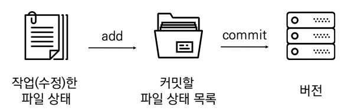
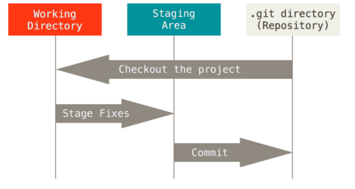

# **Git**

## **-INDEX-**
1. [개요](#1-개요)
2. [분산버전관리시스템(DVCS)](#2-분산버전관리시스템dvcs)
3. [Git 버전 관리 흐름](#3-git-버전-관리-흐름)
4. [Git 필수 설정 정보](#4-git-필수-설정-정보)
5. [Git 로컬 저장소 관련 명령어](#5-git-로컬-저장소-관련-명령어)
6. [원격저장소](#6-원격저장소)
7. [원격저장소 관련 명령어](#7-원격저장소-관련-명령어)
8. [gitignore](#8-gitignore)
9. [Branch](#9-branch)
10. [Branch 주요 명령어](#10-branch-주요-명령어)
11. [Git Flow](#11-git-flow)

---
<br>

## **1. 개요**
* Git은 [분산 버전 관리](https://ko.wikipedia.org/wiki/%EB%B6%84%EC%82%B0_%EB%B2%84%EC%A0%84_%EA%B4%80%EB%A6%AC) 시스템으로 코드의 버전을 관리하는 도구이다.

* 2005년 [리눅스 커널](https://ko.wikipedia.org/wiki/%EB%A6%AC%EB%88%85%EC%8A%A4_%EC%BB%A4%EB%84%90)을 위한 도구로 [리누스 토르발스](https://ko.wikipedia.org/wiki/%EB%A6%AC%EB%88%84%EC%8A%A4_%ED%86%A0%EB%A5%B4%EB%B0%9C%EC%8A%A4)가 개발했다.

* 컴퓨터 파일의 변경사항을 추적하고 여러 명의 사용자들 간에 해당 파일들의 작업을 조율하기도 한다.

<br>

## **2. 분산버전관리시스템(DVCS)**
* 중앙 집중식 버전 관리 시스템은 중앙에서 버전을 관리하고 파일을 받아서 사용한다.

* [분산 버전 관리](https://ko.wikipedia.org/wiki/%EB%B6%84%EC%82%B0_%EB%B2%84%EC%A0%84_%EA%B4%80%EB%A6%AC) 시스템은 원격 저장소(remote repository)를 통하여 협업하고, <br>모든 히스토리를 클라이언트들이 공유한다.

<br>

## **3. Git 버전 관리 흐름**

> 쉽게 설명하면 다음과 같다. <br> 1. 작업을 하고 <br> 2. 변경된 파일을 모아(add) <br> 3. 버전으로 남긴다.(commit)
* 버전(Repository)은 작업(수정)한 파일상태(Working directory)를 커밋할 파일 상태 목록(Staging area로) add한 뒤 commit으로 기록한다.


<br>

* Git은 파일을  modified, staged, committed로 관리한다

  * modified : 파일이 수정된 상태 (add 명령어를 통하여 staging area로)
  * staged : 수정한 파일을 곧 커밋할 것이라고 표시한 상태 (commit 명령어로 저장소)
  * committed : 커밋이 된 상태

  

<br>

## **4. Git 필수 설정 정보**

* 사용자 정보 (commit author) : 커밋을 하기 위해 반드시 필요

  * git config --global user.email `"my@email.com"`
  * git config --global user.name `"username"`

<br>

* 설정 확인

  * git config -l
  * git config --global -l
  * git config user.name

  <br>

## **5. Git 로컬 저장소 관련 명령어**
### **[명령어 정리]**

| **`명령어`** | **`내용`** |
| ----------- | ----------- |
| git init | 로컬 저장소 생성 |
| git add <파일명> | 특정 파일/폴더의 변경사항 추가 |
| git commit -m '<커밋메시지>' | 커밋 (버전 기록) |
| git status | 상태 확인 |
| git log | 버전 확인 |

<br>

1. **init** (저장소 생성) 

**`$ git init`**
* 특정 폴더에 git 저장소(repository)를 만들고 버전 관리

  * .git 폴더가 생성되며
  * git bash에서는 `(master)`라는 표기를 확인할 수 있다

  <br>

2. **add** (커밋 대상 기록) 
**`$ git add <파일>`**
* working directory 상의 변경 내용을 staging area에 추가하기 위해 사용한다.

  * untracked 상태의 파일을 staged로 변경
  * modified 상태의 파일을 staged로 변경

<br>

3. **commit** (버전 기록)
**`$ git commit -m <커밋메시지>`**
* staged 상태의 파일들을 커밋을 통해 버전으로 기록할 수 있다.

* SHA-1 해시를 사용하여 40자 길이의 체크섬을 생성하여 고유한 커밋을 표기한다.

* 커밋 메시지는 변경 사항을 나타낼 수 있도록 명확하게 작성해야 한다.


<br>

4. **log** (커밋 기록 조회)
**`$ git log`**
* 현재 저장소에 기록된 커밋을 조회

* 다양한 옵션을 통해 로그를 조회할 수 있음
  * $ git log -1 (최근 한개)
  * $ git log --oneline (한줄로)
  * $ git log -2 --oneline (최근 두개를 한줄로)

<br>

5. **status** (파일 변경 상태)
**`$ git status`**

* Git 저장소에 있는 파일의 상태를 확인하기 위해 활용된다.

  * 파일의 상태를 알 수 있음
    * Untracked files
    * Changes not staged for commit
    * Changes to be committed
  * Noting to commit, working tree clean

<br>

## **6. 원격저장소**

>원격저장소(Remote Repository) : 파일이 원격 저장소 전용 서버에서 관리되며 여러 사람이 함께 공유하기 위한 저장소이다.

<br>

## **7. 원격저장소 관련 명령어**
### **[명령어 정리]**

| **`명령어`** | **`내용`** |
| ----------- | ----------- |
| git remote add <원격저장소> `<URL>` | 원격저장소 추가 |
| git remote -v | 원격저장소 정보 확인 |
| git remote rm <원격저장소> | 원격저장소 삭제 |
| git push <원격저장소> <브랜치이름> | 원격저장소에 보내기 |
| git pull <원격저장소> <브랜치이름> | 원격저장소로부터 받기 |
| git clone <원격저장소> | 원격저장소 복제 |

  <br>

1. **원격저장소 설정**

**`$ git remote add origin <URL>`**

* 로컬저장소에는 한번만 설정하면 된다.

<br>

2. **원격저장소 확인**

**`$ git remote -v`**

<br>

3. **원격저장소 삭제**

**`$ git remote rm <원격저장소>`**

<br>

4. **Push**(보내기)

**`$ git push <원격저장소이름> <브랜치이름>`**
* 원격 저장소로 커밋을 올려 로컬저장소의 버전을 관리한다.

* 보내기전에 저장소가 있는지 확인해야한다.
```bash
$ git push origin master
remote: Repository not found. # 원격저장소가 없는 경우
fatal: repository 'https://github.com/seho1278/TIL.git/' not found
```

<br>

5. **Pull**(받기)

**`$ git pull <원격저장소이름> <브랜치이름>`**
* 원격 저장소로 변경된 내역을 받아온다.

<br>

6. **Clone**(복제)

**`$ git clone <원격저장소주소>`**
* 원격 저장소를 복제하여 가져온다.

<br>

## **8. gitignore**

* 버전 관리와 상관없는 파일들을 관리해주는 기능이다.
  * Git 저장소에 .gitignore 파일을 생성하고 해당 내용을 관리한다.
  * 커밋된 파일은 .gitignore 되지않으니 반드시 삭제후 적용해야 한다.

  <br>

* 작성예시
  * 특정 파일 : a.txt (모든 a.txt), test/a.txt(test 폴더의 a.txt)
  * 특정 디렉토리 : /my_secret
  * 특정 확장자 : *.exe
  * 예외 처리 : !b.exe

  <br>

* 일반적으로 개발언어나 개발환경 등의 파일이 있다.
  * 개발언어 예시) 파이썬 : venv/, 자바스크립트 : node_modules/
  * 개발환경
    * 운영체제 (windows, max, linux)
    * 텍스트 에디터 / IDE (visual studio code 등)

  <br>

## **9. Branch**

* 독립적인 작업 흐름을 만들고 관리하는 것을 말한다.

  <br>

## **10. Branch 주요 명령어**

### **[명령어 정리]**

| **`명령어`** | **`내용`** |
| ----------- | ----------- |
| git branch <브랜치이름> | 브랜치 생성 |
| git checkout <브랜치이름> | 브랜치 이동 |
| git checkout -b <브랜치이름> | 브랜치 생성 및 이동 |
| git checkout -d <브랜치이름> | 브랜치 삭제 |
| git branch | 브랜치 목록 |
| git merge <브랜치이름> | 브랜치 병합 |

<br>

1. **브랜치 생성**

**`(master) $ git branch <브랜치이름>`**

<br>

2. **브랜치 이동**

**`(master) $ git checkout <브랜치이름>`**

<br>

3. **브랜치 생성 및 이동**

**`(master) $ git checkout -b <브랜치이름>`**

<br>

4. **브랜치 삭제**

**`(master) $ git checkout -d <브랜치이름>`**

<br>

5. **브랜치 목록**

**`(master) $ git branch`**

<br>

6. **브랜치 병합**

**`(master) $ git merge <브랜치이름>`**
* master 브랜치에서 <브랜치이름>을 병합한다.

  <br>

## **11. Git Flow**
> Git Flow 과정을 간단하게 설명하면 다음과 같다. <br> 1. 원격저장소를 Clone으로 가져온다. <br> 2. Branch를 생성해 작업한다. <br> 3. 작업한 내용을 commit 한다. <br> 4. GitHub으로 Push한다. <br> 5. Pull request 한다. <br> 6. code review 한다. <br> 7. merge한다.

<br>

* Git Flow는 Git Branch 전략 중 하나로 기능이 아닌 방법론을 뜻한다.

* Git Flow는 주로 프로젝트 등 협업에 사용되고 있으며, 대표적으로 [우아한형제들](https://techblog.woowahan.com/2553/)이 있다.

* Git Flow 전략은 다음과 같다.
  * master : 배포 가능한 상태의 코드
  * develop : feature branch로 나눠지거나, 발생된 버기 수정 등 개발 진행
      * 개발 후 release branch로 분기
  * feature branch : 기능별 개발 브랜치
    * 기능이 반영되거나 드랍되는 경우 브랜치 삭제
  * release branch : 개발 완료 이후 QA/Test 등을 통해 얻어진 다음 배포 전 minor bug fix 등 반영
  * hotfixes : 긴급하게 반영 해야하는 bug fix
    * release branch - 다음 버전 / hotfixes - 현 버전

<br>

* Git Flow 기본원칙은 다음과 같다.
  * master branch는 반드시 배포가능한 상태여야 한다.
  * feature branch는 각 기능의 의도를 알 수 있도록 작성한다.
  * Commit message는 명확하게 작성한다.
  * Pull Request를 통해 협업을 진행한다.
  * 변경사항을 반영하고 싶다면, master branch에 병합한다.

  <br>

* Git Flow는 Shared Repository Model을 통해 팀원을 초대할 수 있고 또는 Fork를 이용해 권한을 받아 참여할 수 있다.

<br>

<br>

<br>

### [위로](#git) / [뒤로](/Git/README.md)