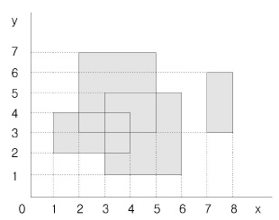

### 직사각형 네개의 합집합 면적 구하기

```python
n_dict = {}
for n in range(4):
    N = list(map(int, input().split()))
    for i in range(N[0], N[2]):
        for j in range(N[1], N[3]):
            n_dict[(i, j)] = 1

print(sum(n_dict.values()))
```

