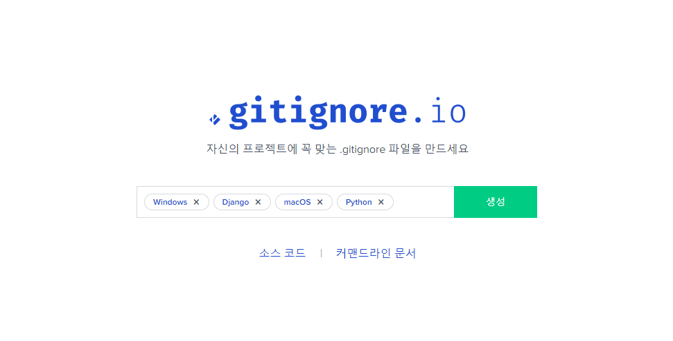
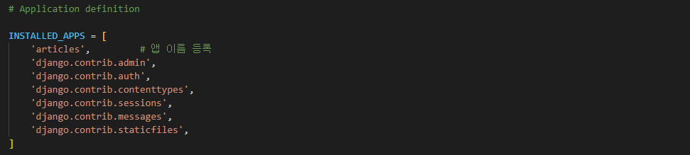

# 개발 환경 설정 가이드

## **-INDEX-**
* 개발 환경 설정
1. [개요](#1-개요)
2. [가상환경 생성 및 활성화](#2-가상환경-생성-및-활성화)
3. [django 설치](#3-django-설치)
4. [의존성 파일 생성](#4-의존성-파일-생성)
5. [django 프로젝트 생성](#5-django-프로젝트-생성)
6. [django 서버 실행](#6-django-서버-실행)

 

* gitignore
1. [gitignore 작성](#gitignore-작성)

 

* 앱 설치 & 등록
1. [앱 설치](#1-앱-생성)
2. [앱 등록](#2-앱-등록)
---
 

## **1. 개요**
* 로그인, 로그아웃, 회원관리, 데이터베이스, 보안 등 웹 서비스 개발에 필요한  많은 기술들을
  직접 만들지 않고 잘 만들어진 것들을 가져와 좋은 환경에서 사용하기위해 django라는 framework가 존재한다.

* framework는 기본적인 구조와 규칙을 제공하기 때문에 필수적인 개발에만 집중 할 수 있다는 장점이 있고 여러 라이브러리를 제공해 개발 속도를 높일 수 있으며 유지보수와 확장에 용이해 소프트웨어에 품질을 높일 수 있다.

 

## **2. 가상환경 생성 및 활성화**
* 가상환경 생성 : python -m venv (가상환경 이름)
  * 가상환경 이름은 가능한 venv로 한다.

 

* 가상환경 활성화 : source venv/Scripts/activate
* 가상환경 비활성화 : deactivate

 

## **3. django 설치**
* django 설치 : pip install django==(버전)
  * (버전)을 명시하지 않을 경우 최신버전으로 설치된다.
  * 프로젝트의 경우 시간이 많이 걸리기 때문에 안정적이고 장기간 지원되는
    lts 버전을 사용하는 것이 좋다.

 

* Package, Version 확인 : pip list

 

## **4. 의존성 파일 생성**
* pip freeze > (파일명).txt
  * 파일명은 가능한 requirements로 한다
  * 패키지 설치마다 진행해 주어야 한다.

 

## **5. django 프로젝트 생성**
* django 프로젝트 생성 : django-admin startproject (프로젝트 이름) .
  * . 은 현재 위치를 말한다

 

## **6. django 서버 실행**
* python manage.py runserver
  * python manage.py는 동작시켜주는 파일이고 명령어는 반드시 동일 경로에서 진행해야한다.
  * 셋팅 없어도 실행은 가능하다.
  * Ctrl + c 단축키로 서버를 종료할 수 있다.

 

 

# git 초기화 시 필수 사항

## gitignore 작성
* 가상환경 경로에 gitignore 파일을 생성한 후 gitignore.io에서 맞는 운영체제, 개발 환경, 프로그래밍 언어를 검색해 가져온다.

 

 

# 앱 생성 & 등록

## 1. 앱 생성
* 앱 생성 : python manage.py startapp (앱 이름)
  * 앱의 이름은 '복수형'으로 지정하는 것을 권장
  * templates 폴더는 따로 만들어 주어야 한다.

 

## 2. 앱 등록
* 생성된 프로젝트 폴더의 setting.py로 들어가 INSTALLED_APPS 부분에 (앱 이름)을 추가한다.
  * 등록은 반드시 앱 생성 후에 진행해야 한다.

 

 

 

### [위로](#개발-환경-설정-가이드) / [뒤로](/django/README.md)