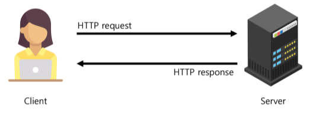

# Static Files

## **-INDEX-**
1. [개요](#1-개요)
2. [static files 제공](#2-가상환경-생성-및-활성화)
3. [Media files](#3-django-설치)
4. [이미지 업로드 및 제공](#4-의존성-파일-생성)

## **1. 개요**
* static files는 JS, CSS, Img 파일 등 처럼 서버 측에서 변경되지 않고 고정적으로 제공되는 정적 파일이다.

 

* 웹 서버의 기본동작은
  * 특정 위치(URL)에 있는 자원을 요청(HTTP request) 받아서
  * 응답(HTTP request)을 처리하고 제공(serving)하는 것

* 웹 서버는 요청 받은 URL로 서버에 존재하는 정적 자원을 제공해주기 때문에
* 정적 파일을 제공하기 위한 경로(URL)가 있어야 한다.

 

## 2. static files 제공
* 기본 경로 : app/static/

* 추가 경로 : settings.py에 STATICFILES_DIRS를 리스트 형태로 추가해 준다.
  * URL 검색시 
